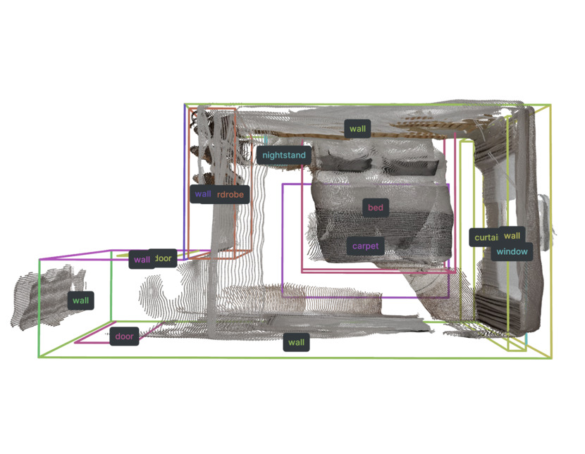
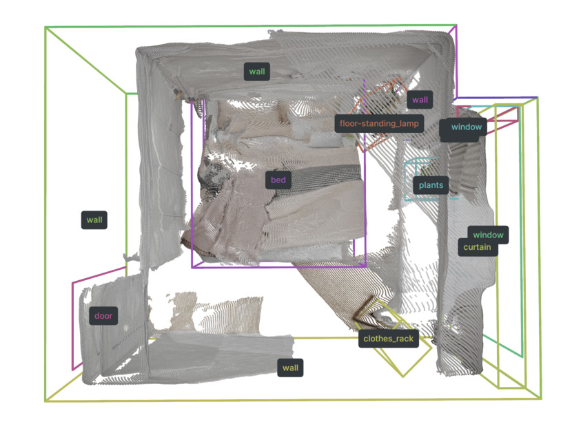
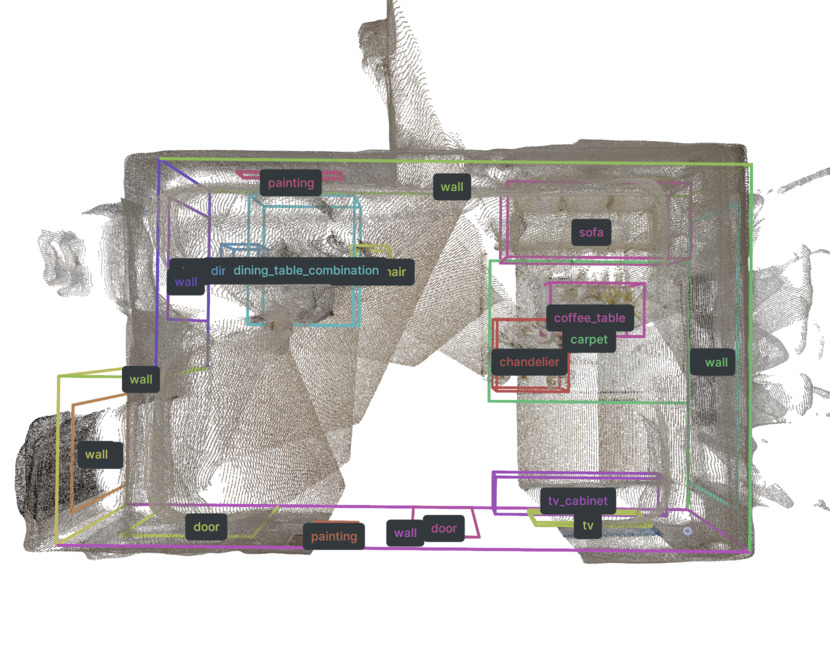
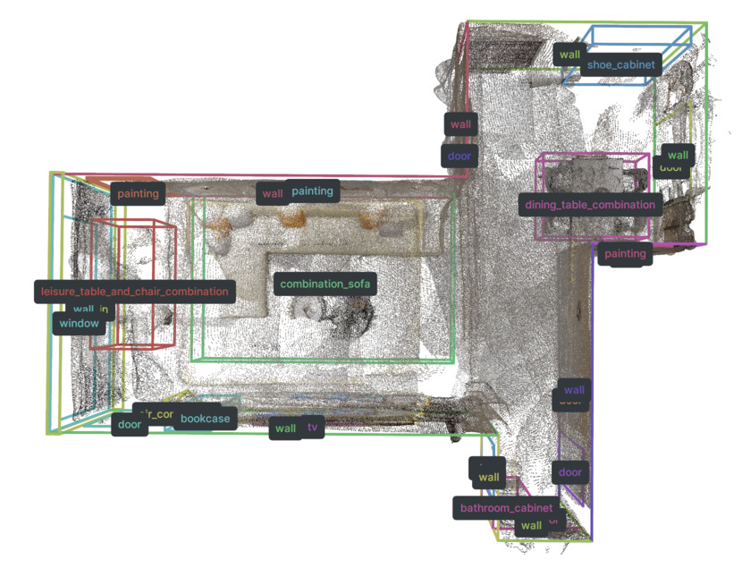

# SpatialLM Testset

[Project page](https://manycore-research.github.io/SpatialLM) | [Paper](https://arxiv.org/abs/2506.07491) | [Code](https://github.com/manycore-research/SpatialLM)

We provide a test set of 107 preprocessed point clouds and their corresponding GT layouts, point clouds are reconstructed from RGB videos using [MASt3R-SLAM](https://github.com/rmurai0610/MASt3R-SLAM). SpatialLM-Testset is quite challenging compared to prior clean RGBD scan datasets due to the noises and occlusions in the point clouds reconstructed from monocular RGB videos.

<table style="table-layout: fixed;">
  <tr>
    <td style="text-align: center; vertical-align: middle; width: 25%"> </td>
    <td style="text-align: center; vertical-align: middle; width: 25%"> </td>
    <td style="text-align: center; vertical-align: middle; width: 25%"> </td>
    <td style="text-align: center; vertical-align: middle; width: 25%"> </td>
   </tr> 
  </tr>
</table>

## Folder Structure

Outlines of the dataset files:

```bash
project-root/
├── pcd/*.ply                   # Reconstructed point cloud PLY files
├── layout/*.txt                # GT FloorPlan Layout
├── benchmark_categories.tsv    # Category mappings for evaluation
└── test.csv                    # Metadata CSV file with columns id, pcd, layout
```

## Usage

Use the [SpatialLM code base](https://github.com/manycore-research/SpatialLM/tree/main) for reading the point cloud and layout data.

```python
from spatiallm import Layout
from spatiallm.pcd import load_o3d_pcd

# Load Point Cloud
point_cloud = load_o3d_pcd(args.point_cloud)

# Load Layout
with open(args.layout, "r") as f:
    layout_content = f.read()
layout = Layout(layout_content)
```

## Visualization

Use `rerun` to visualize the point cloud and the GT structured 3D layout output:

```bash
python visualize.py --point_cloud pcd/scene0000_00.ply --layout layout/scene0000_00.txt --save scene0000_00.rrd
rerun scene0000_00.rrd
```
